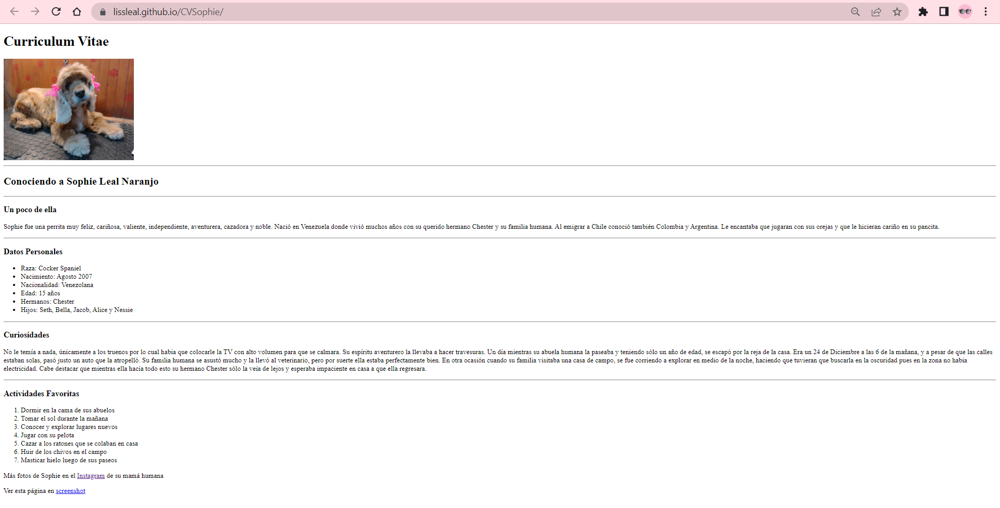
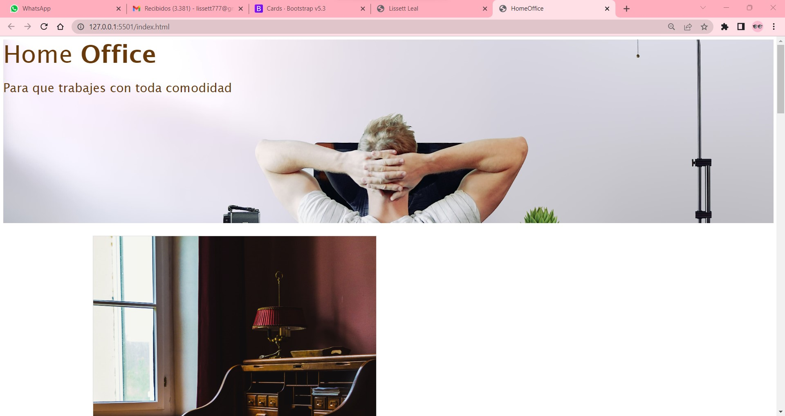
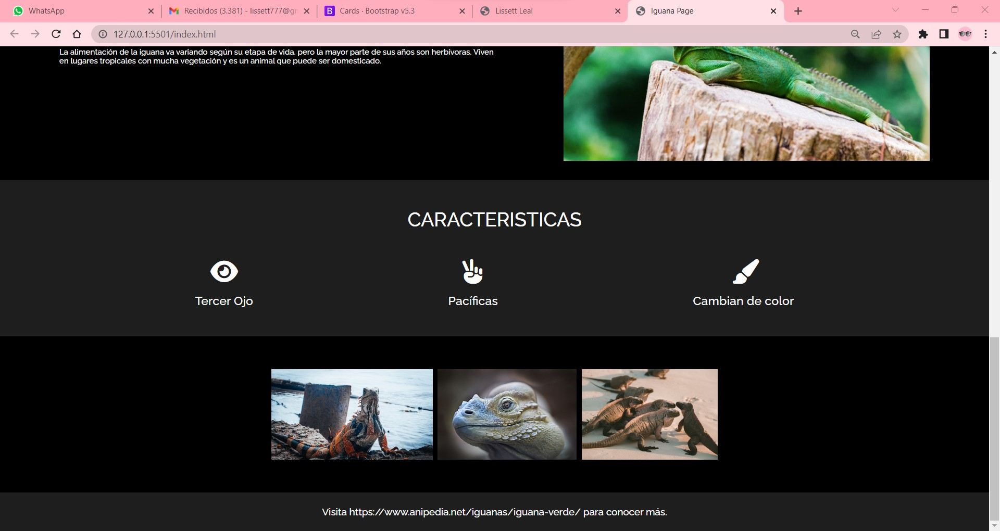
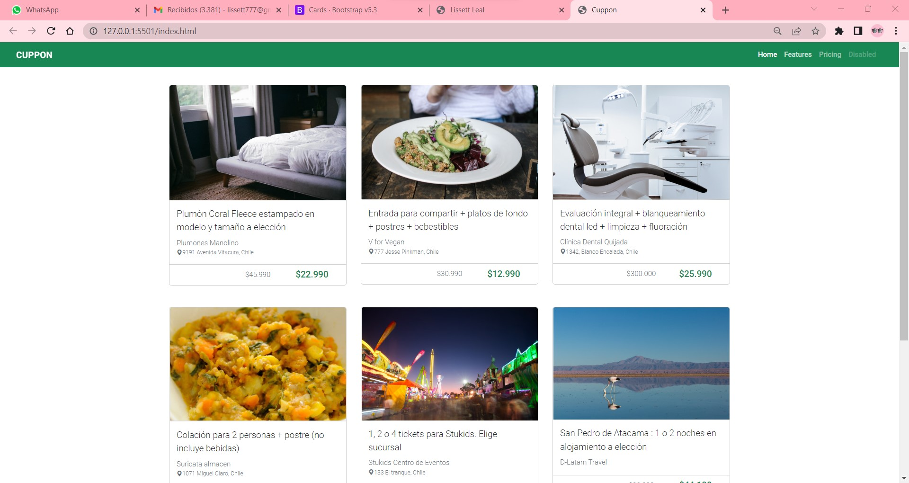
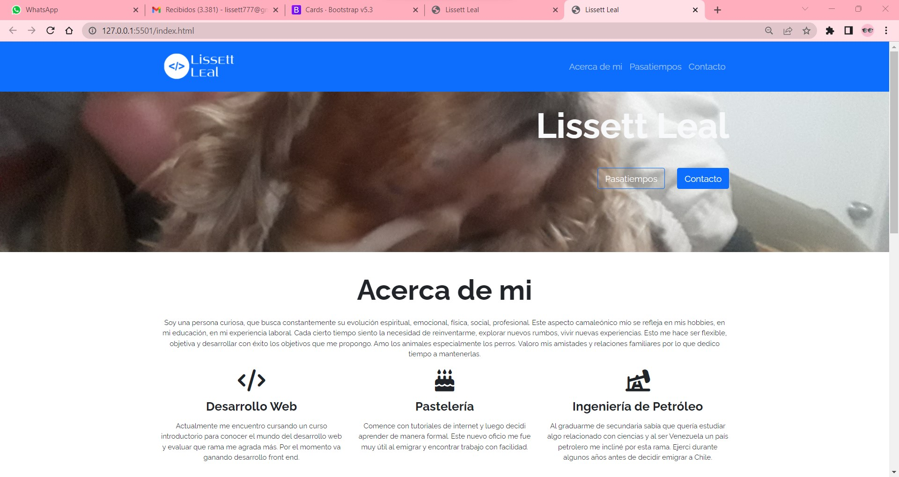

##Curso Introductorio Desafio Latam
# Semana 6 Proyecto Final

Este proyecto fue creado para poner en practica conceptos básicos adquiridos durante todo el curso.
 
<a href="https://lissleal.github.io/portafolio/">PORTAFOLIO</a>

Proyecto Semana 1
HTML

<a href="https://github.com/lissleal/CVSophie">Repositorio</a>

Proyecto Semana 2
CSS

<a href="https://github.com/lissleal/landingdeco">Repositorio</a>

Proyecto Semana 3
Posicionamiento CSS

<a href="https://github.com/lissleal/iguanapage">Repositorio</a>

Proyecto Semana 4
Bootstrap

<a href="https://github.com/lissleal/cupponpage">Repositorio</a>

Proyecto Semana 5
GITHUB

<a href="https://github.com/lissleal/unpocodemi">Repositorio</a>

